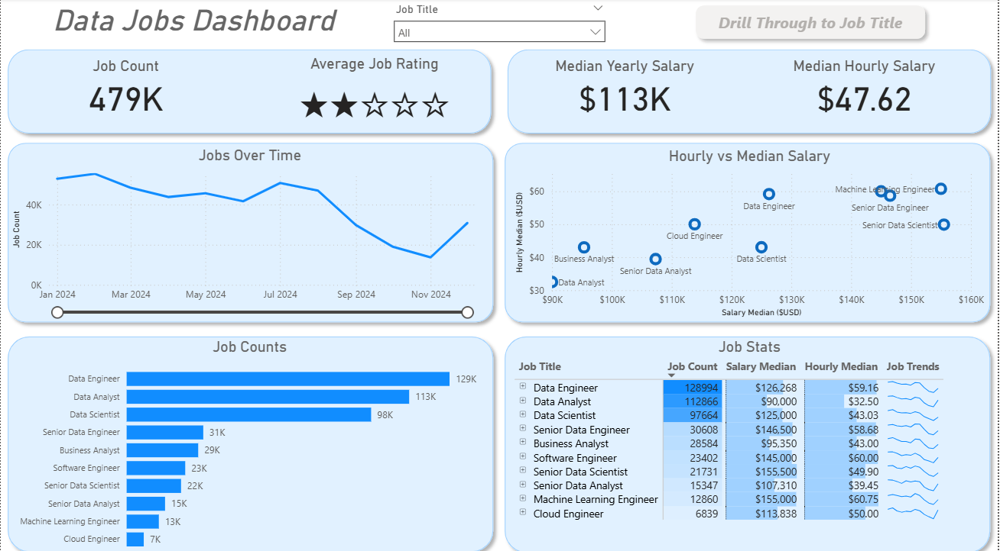
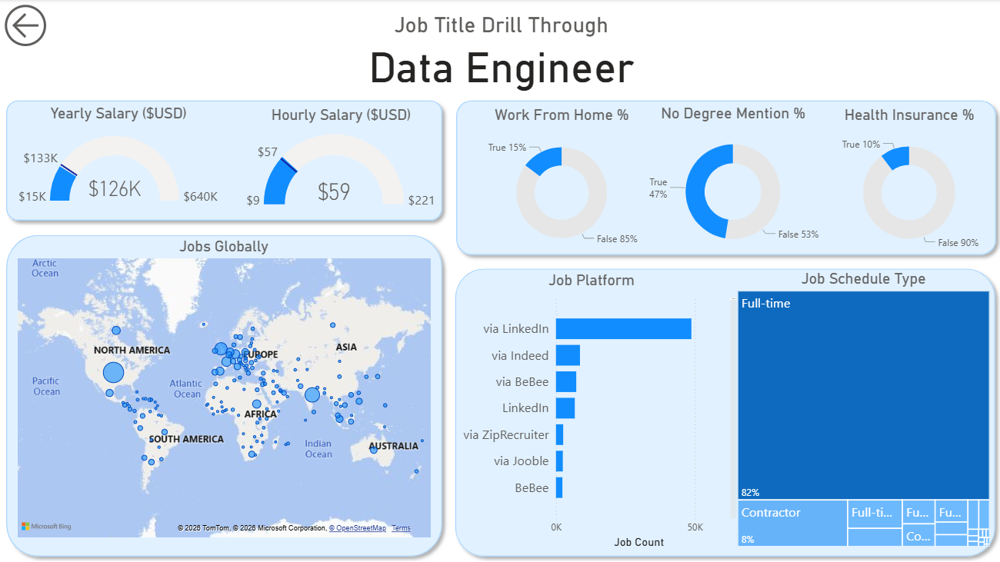

## Introduction

This dashboard was built for job seekers, career switchers, and professionals exploring data roles who need a clearer view of the job market.

Using a real-world dataset of 2024 data-related job postings (including job titles, salaries, and locations), it provides a single, interactive interface to explore trends and compensation.

### Dashboard File
You can find the file for the dashboard here: [`Data_Jobs_Dashboard.pbix`](Data_Jobs_Dashboard.pbix).  

---

## Skills Showcased

This project covers several key Power BI features:

- Data transformation (ETL) with Power Query: cleaned and prepared the data by handling missing values, adjusting data types, and creating new columns.
- Implicit measures: created measures such as median yearly salary and job count.
- Core charts: used column, bar, line, and area charts to compare job counts and analyze trends over time.
- Geospatial analysis: used map charts to show the distribution of jobs across locations.
- KPI indicators and tables: used cards for key metrics and tables for more detailed data.
- Dashboard design: focused on a clear and simple layout to present insights effectively.
- Interactive reporting:
  - slicers to filter by job title
  - buttons and bookmarks for navigation
  - drill-through for moving from summary to detailed views

---

## Dashboard Overview

This report is split into two pages to provide both a high-level summary and a more detailed analysis.

### Page 1: High-Level Market View

 

This page provides an overview of the market, including total job count, median salaries, and the most common job titles.

### Page 2: Job Title Drill Through

  

This page allows for more detailed analysis. Users can drill through from the main dashboard to explore a specific job title, including salary ranges, remote work information, top hiring platforms, and job locations.

---

## Conclusion

This dashboard shows how Power BI can be used to turn raw job posting data into useful insights. It allows users to explore and filter the data to better understand the job market and support career decisions.