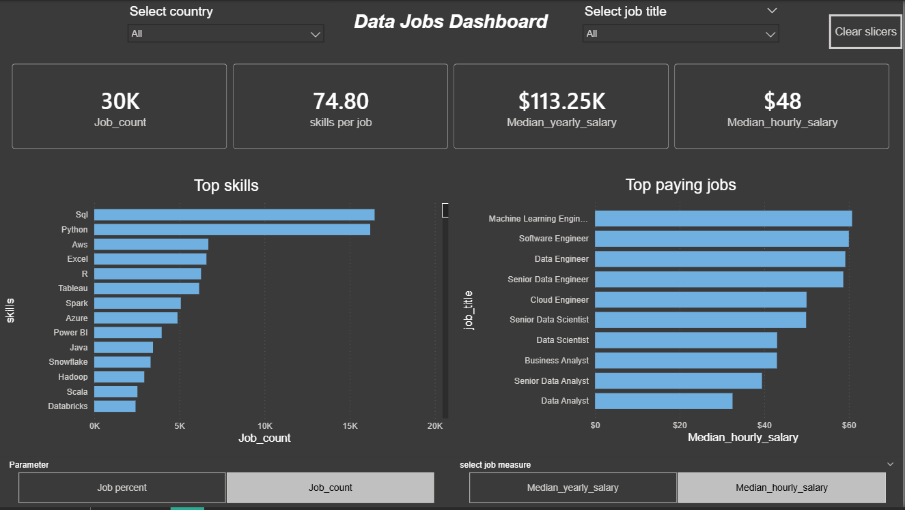

# Data Jobs Dashboard 2.0 w/ Power BI

## Introduction

This dashboard was built for job seekers, career switchers, and professionals exploring data roles who want a clearer and faster view of the job market.

Using a real-world dataset of 2024 data job postings (including job titles, salaries, skills, and locations), it provides a single-page, interactive interface to explore trends and compensation insights efficiently.

### Dashboard File
You can find the file for the dashboard here: [`Data_Jobs_Dashboard_2.0.pbix`](Data_Jobs_Dashboard_2.0.pbix).

---

## Skills Showcased

This project demonstrates several core Power BI skills:

- Dashboard design: created a clean, single-page layout focused on usability and quick insights.
- Data transformation (ETL) with Power Query: cleaned and prepared the dataset by handling missing values, adjusting data types, and shaping the data.
- Data modeling: built relationships between tables following star schema principles.
- DAX fundamentals: created measures such as median yearly salary, median hourly salary, job count, and skills per job.
- Core charts: used column, bar, line, and area charts to analyze trends and comparisons.
- Geospatial analysis: used map visuals to represent job distribution by location.
- KPI indicators and tables: used cards for key metrics and tables for detailed data.
- Interactive reporting:
  - slicers to filter by job title and other attributes
  - buttons and bookmarks for navigation
  - drill-through for deeper analysis

---

## Dashboard Overview

This version (2.0) is designed as a single-page dashboard to provide the most important insights at a glance.

### Main Dashboard View

This page provides a concise overview of the data job market, including:

- total job count  
- median yearly and hourly salaries  
- average skills required per job  
- skill popularity (by count and percentage)  
- salary comparison across job titles  

The layout is designed to allow users to quickly filter and explore the data without navigating between multiple pages.

---

## Conclusion

This dashboard demonstrates how Power BI can transform raw job posting data into a focused and interactive analytical tool. By consolidating all key insights into a single page, it allows users to quickly explore market trends and make more informed career decisions.
